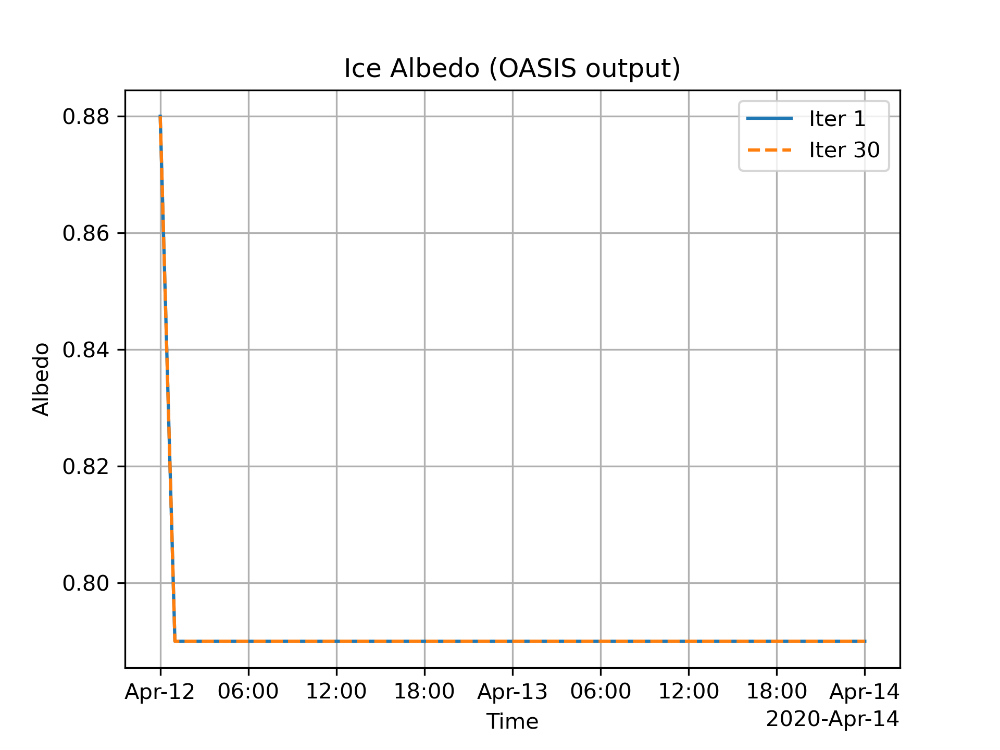
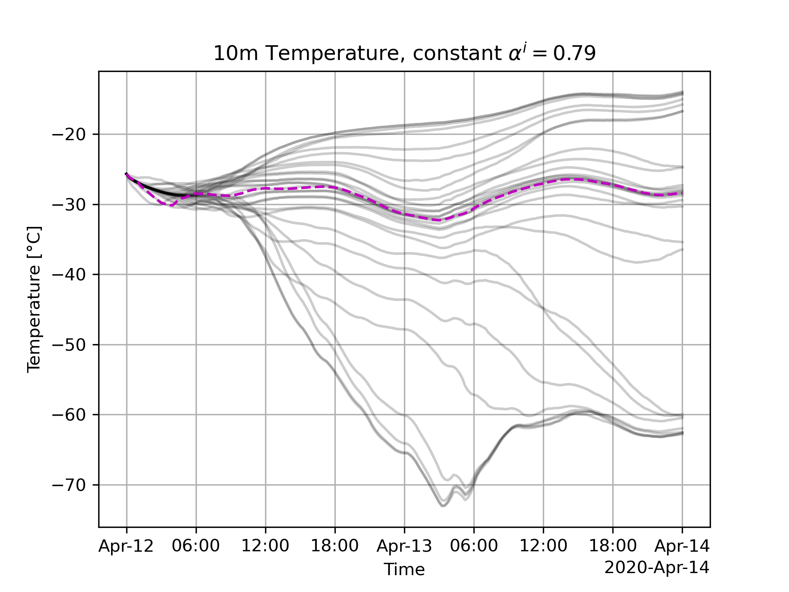

# Implications of Setting A Constant Albedo in LIM3

Question: Does setting a constant albedo in NEMO 3.6/LIM3 fix the oscillations when running SWR, similar to NEMO4.0.1/SI3?
Answer: No.

## Steps to reproduce

Before running: Double-check that `top-ensemble.py` produces the large oscillations as reported in the paper.

### Step 1: Change `alb_ice` subroutine in NEMO3.6

Added the following lines at the end of `albedo_ice` subroutine in `sources/nemo-3.6/NEMO/OPA_SRC/SBC/albedo.F90`:

```fortran
    SUBROUTINE albedo_ice( pt_ice, ph_ice, ph_snw, pa_ice_cs, pa_ice_os )
      ! ... same code as before
      ! New code:
      ! Explicitly set clear and overcast albedo values to namelist parameter
      pa_ice_os(:,:,:) = rn_albice
      pa_ice_cs(:,:,:) = rn_albice
      !
      CALL wrk_dealloc( jpi,jpj,ijpl, zalbfz, zficeth )
      !
    END SUBROUTINE albedo_ice
``` 

**Then: Recompile NEMO and OpenIFS as described [here](https://dev.ec-earth.org/projects/ecearth3/wiki/Single_Column_Coupled_EC-Earth)!**

### Step 2: Set namelist parameter

In NEMO3.6, the albedo namelist parameters are part of the NEMO (not LIM) namelist `namsbc_alb` in `runtime/scm-classic/PAPA/namelists/namelist.nemo.ref.sh`. I changed `rn_albice` to 0.79 (mean albedo value in the experiments with the newest version of the AOSCM).


### Step 3: Run the first experiment from the TOP ensemble

For this, you can modify `top_ensembly.py`:

- change `for start_date in start_dates[:13]:` to `for start_date in start_dates[:1]:` in the `run_cvg_ensemble` function
- make sure that `run_cvg_ensemble()` is called when running `python top_ensemble.py`
- run the script

### Step 4: Check that albedo is indeed constant

In LIM3, albedo values are not part of ice model output. Instead, one can plot the values sent by OASIS:

```python
from AOSCMcoupling.files import OASISPreprocessor
import pandas as pd
from pathlib import Path
import matplotlib.pyplot as plt
import xarray as xr

# Plot Albedo Values as sent by OASIS
ax.set(title=r"10m Temperature, constant $\alpha^i=0.79$", ylabel="Temperature [°C]", xlabel="Time")
ax.grid()
fig.savefig("lim_constant_albedo.png", dpi=300)

fig, ax = plt.subplots()
preprocess = OASISPreprocessor(origin).preprocess
da = xr.open_mfdataset("/home/valentina/dev/aoscm/experiments/PAPA/TNSB_1/O_AlbIce_oceanx_08.nc", preprocess=preprocess)
da.plot(ax=ax, label="Iter 1")
da = xr.open_mfdataset("/home/valentina/dev/aoscm/experiments/PAPA/TNSB_30/O_AlbIce_oceanx_27.nc", preprocess=preprocess)
da.plot(ax=ax, label="Iter 30", ls="--")
ax.set(title="Ice Albedo (OASIS output)", xlabel="Time", ylabel="Albedo")
ax.legend()
ax.grid()
fig.savefig("const_albedo_lim3_alpha_i.png", dpi=300)
```

This produced the following plot:



The first time step is different since the value of the ice albedo in the restart file is different from `0.79`.
However, one can see that $\alpha^i=0.79$ for the rest of the simulation, no matter the SWR iteration.

### Step 5: Check whether the model output still produces SWR oscillations

Plotting code:

```python
from AOSCMcoupling.files import OIFSPreprocessor
import pandas as pd
from pathlib import Path
import matplotlib.pyplot as plt
import xarray as xr

origin = pd.Timestamp("2020-04-12")
preprocess = OIFSPreprocessor(origin).preprocess

# Plot T10m Iterations
iters = list(range(1, 31))
base_path = Path("/home/valentina/dev/aoscm/experiments/PAPA/")
dirs = [base_path / f"TNSB_{iter}" for iter in iters]

progvars = []
for dir in dirs:
    ds = xr.open_mfdataset(dir / "progvar.nc", preprocess=preprocess)
    progvars.append(ds)

fig, ax = plt.subplots()

for iter in iters[1:]:
    (progvars[iter - 1].t - 273.15).isel(nlev=-1).plot(ax=ax, color="k", alpha=0.2)
(progvars[0].t - 273.15).isel(nlev=-1).plot(ax=ax, color="m", ls="--")

ax.set(title=r"10m Temperature, constant $\alpha^i=0.79$", ylabel="Temperature [°C]", xlabel="Time")
ax.grid()
fig.savefig("const_albedo_t10m.png", dpi=300)
```

This produced the following plot:



It is clear that keeping the albedo at a constant value does not affect the SWR convergence in LIM3.
