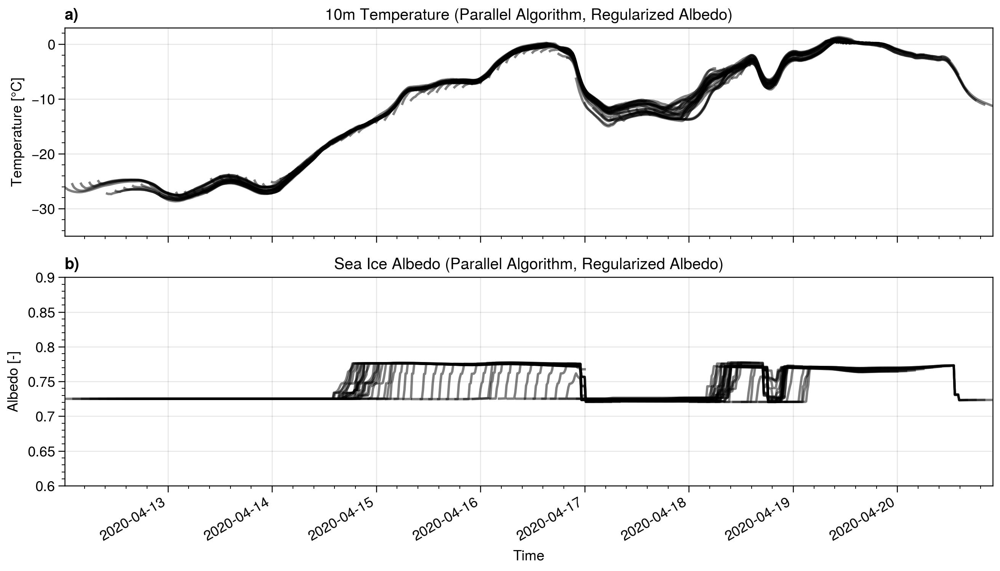
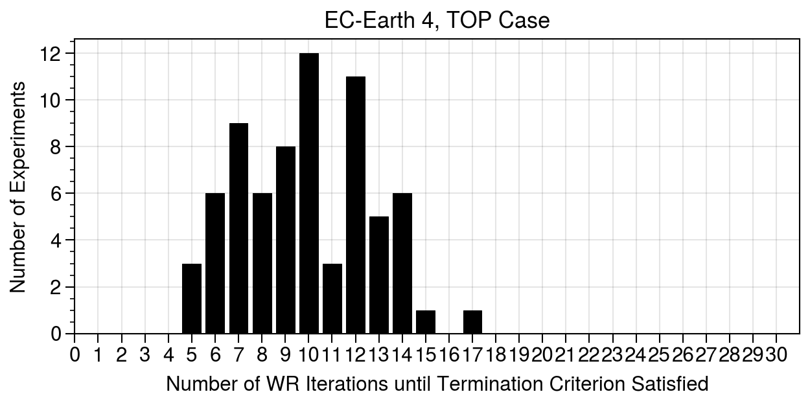
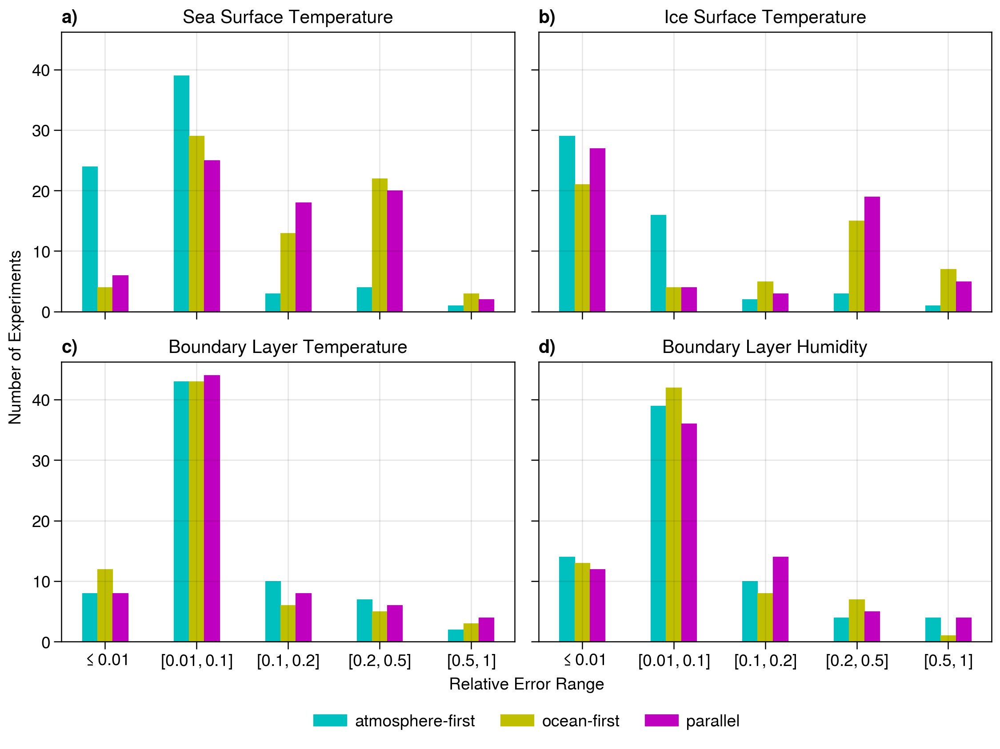

# Experiments with a Regularized Albedo Parameterization

This is the regularized albedo routine we use (see branch [regularized-albedo](https://git.smhi.se/e8155/ece4-aogcm-oifs43/-/tree/regularized-albedo)):

```fortran
SUBROUTINE ice_alb( pt_su, ph_ice, ph_snw, ld_pnd_alb, pafrac_pnd, ph_pnd, palb_cs, palb_os )
    REAL(wp), INTENT(in   ), DIMENSION(:,:,:) ::   pt_su        !  ice surface temperature (Kelvin)
    REAL(wp), INTENT(in   ), DIMENSION(:,:,:) ::   ph_ice       !  sea-ice thickness
    REAL(wp), INTENT(in   ), DIMENSION(:,:,:) ::   ph_snw       !  snow depth
    LOGICAL , INTENT(in   )                   ::   ld_pnd_alb   !  effect of melt ponds on albedo
    REAL(wp), INTENT(in   ), DIMENSION(:,:,:) ::   pafrac_pnd   !  melt pond relative fraction (per unit ice area)
    REAL(wp), INTENT(in   ), DIMENSION(:,:,:) ::   ph_pnd       !  melt pond depth
    REAL(wp), INTENT(  out), DIMENSION(:,:,:) ::   palb_cs      !  albedo of ice under clear    sky
    REAL(wp), INTENT(  out), DIMENSION(:,:,:) ::   palb_os      !  albedo of ice under overcast sky
    !
    INTEGER  ::   ji, jj, jl                ! dummy loop indices
    REAL(wp) ::   z1_c1, z1_c2, z1_c3, z1_c4 ! local scalar
    REAL(wp) ::   zepsS, zepsT, zbetaT, zbetaS
    REAL(wp) ::   zregionT, zregionS        ! size of transition region
    REAL(wp) ::   zcff,zval_dry,zval_mlt
    REAL(wp) ::   zalb_ice, zafrac_ice      ! bare sea ice albedo & relative ice fraction
    REAL(wp) ::   zalb_snw, zafrac_snw      ! snow-covered sea ice albedo & relative snow fraction
    !!---------------------------------------------------------------------
    !
    IF( ln_timing )   CALL timing_start('icealb')
    !
    z1_c1   = 1. / ( LOG(1.5) - LOG(0.05) )
    z1_c2   = 1. / 0.05
    z1_c3   = 1. / 0.02
    z1_c4   = 1. / 0.03
    zepsS = 2.5e-3
    zepsT = 2.5e-3
    zregionS = 4 * zepsS
    zregionT = 4 * zepsT
    !
    DO jl = 1, jpl
        DO jj = 1, jpj
        DO ji = 1, jpi
            zbetaS =      1. / (1. + EXP(-(ph_snw(ji,jj,jl) - zregionS )         / zepsS)) ! ~0 if hs=0 and ~1 if hs>0
            zbetaT = 1. - 1. / (1. + EXP( (pt_su(ji,jj,jl)  - (rt0 - zregionT) ) / zepsT)) ! ~0 if Ti<0 and ~1 if Ti>=0
            zafrac_snw = zbetaS
            zafrac_ice = 1. - zbetaS
            !--- Bare ice albedo (for hi > 150cm)
            zcff     = (1.-zbetaS)*(1.-zbetaT)+zbetaS
            zalb_ice = (1.-zbetaS)*zbetaT*rn_alb_imlt + zcff*rn_alb_idry
            !--- Bare ice albedo (for hi < 150cm)
            IF( 0.05 < ph_ice(ji,jj,jl) .AND. ph_ice(ji,jj,jl) <= 1.5 ) THEN      ! 5cm < hi < 150cm
                zalb_ice = zalb_ice    + ( 0.18 - zalb_ice   ) * z1_c1 * ( LOG(1.5) - LOG(ph_ice(ji,jj,jl)) )
            ELSEIF( ph_ice(ji,jj,jl) <= 0.05 ) THEN                               ! 0cm < hi < 5cm
                zalb_ice = rn_alb_oce  + ( 0.18 - rn_alb_oce ) * z1_c2 * ph_ice(ji,jj,jl)
            ENDIF
            !--- Snow-covered ice albedo (freezing, melting cases)
            zval_dry = rn_alb_sdry - ( rn_alb_sdry - zalb_ice ) * EXP( - ph_snw(ji,jj,jl) * z1_c3 )
            zval_mlt = rn_alb_smlt - ( rn_alb_smlt - zalb_ice ) * EXP( - ph_snw(ji,jj,jl) * z1_c4 )
            zalb_snw = (1.-zbetaT)*zval_dry+zbetaT*zval_mlt
            !                       !--- Surface albedo is weighted mean of snow, ponds and bare ice contributions
            palb_os(ji,jj,jl) = ( zafrac_snw * zalb_snw + zafrac_ice * zalb_ice ) * tmask(ji,jj,1)
            !
            palb_cs(ji,jj,jl) = palb_os(ji,jj,jl)  &
                &                - ( - 0.1010 * palb_os(ji,jj,jl) * palb_os(ji,jj,jl)  &
                &                    + 0.1933 * palb_os(ji,jj,jl) - 0.0148 ) * tmask(ji,jj,1)
            !
        END DO
        END DO
    END DO
    !
    !
    IF( ln_timing )   CALL timing_stop('icealb')
    !
END SUBROUTINE ice_alb
```

This routine produces physically reasonable results:



Coupling scheme results produced with this routine:
- SWR terminates successfully in 81/84 experiments; mean (median) of 9.9 (10) iterations
- maximum coupling errors:
  - atmospheric temperature: 3.31 °C
  - moisture: 0.51 g/kg
  - sea surface temperature: 0.01 °C
  - ice surface temperature: 3.19 °C
- how often did each coupling scheme "win":
  - atmospheric temperature: atm-first: 19, oce-first: 30, parallel: 22
  - moisture: atm-first: 19, oce-first: 33, parallel: 19
  - ice surface temperature: atm-first: 55, oce-first: 12, parallel: 4
  - sea surface temperature: atm-first: 55, oce-first: 10, parallel: 6




